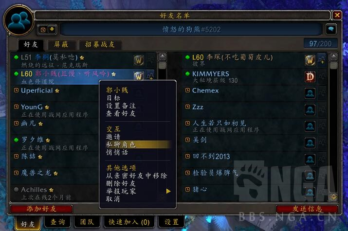
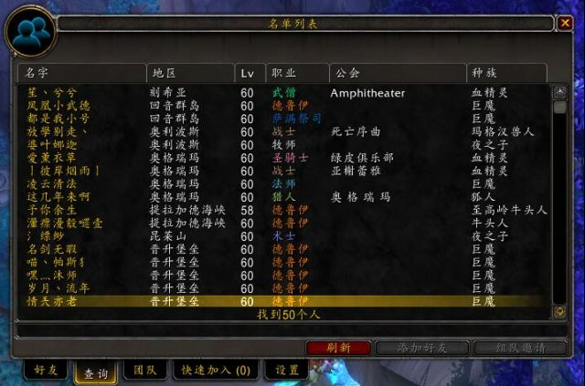
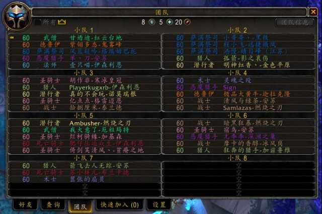
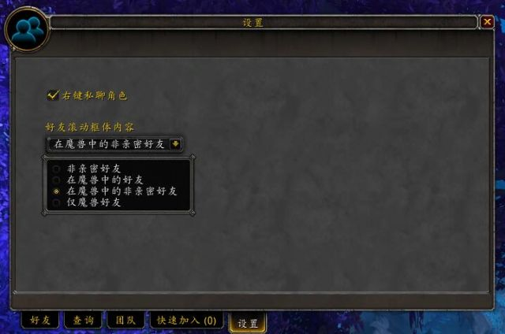

# ExtUI-Friends
一款扩展了好友框体的魔兽世界插件。

[[工具] [原创] [正式服] [好友框体扩展] 好友列表上色、私聊战网好友角色的无污染扩展插件——ExtUI-Friends](https://bbs.nga.cn/read.php?tid=29137372)

# Feature
ExtUI-Friends属于对暴雪原生插件进行的扩展，不含插件库。ExtUI-Friends只做了正式服的版本。

这个插件的主要功能很简单，就是扩展好友框体，在好友框体右侧添加一个滚动框体方便好查看和寻找好友。

此外还有一些额外的功能：
1. 右侧的滚动框体支持四种显示模式：“非亲密好友”、“在魔兽中的好友”、“在魔兽中的非亲密好友”、“仅魔兽好友”。
2. 好友上色，根据好友角色的职业对好友列表上色，并且不会触发暴雪的污染机制。当好友在非正式服或与自己不在一个阵营则角色名呈现灰色(战网名字依然是职业颜色)
3. 整合了MyBuddies插件，在右上角显示好友/屏蔽数量。
4. 右键添加私聊目标角色，你可以直接私聊对方的角色，而不是战网账号。
5. 双击私聊游戏角色或战网。
6. 扩展查询的名单列表，你可以完整的看到所查询角色的地区、公会和种族。
7. 扩展团队列表，你可以完整看到角色名称。
8. 修复了团队成员变化时好友框体下方的白色材质条会消失的情况。

# works
插件支持版本为：90100

# guide
下载后放入对应的游戏目录即可。
例如：
> F:\World of Warcraft\_retail_\Interface\AddOns

# explain
1. FriendListColors插件也可以对好友列表进行上色，但这个插件会触发暴雪的污染机制，导致无法设置焦点和设置团队权限，建议不使用。而ExtUI-Friends不会触发暴雪的污染机制。
2. BlizzMove插件也会导致好友列表触发暴雪的污染机制，这个我晚点会处理这个问题。
3. 右侧的滚动框体是对左侧的暴雪原本的框体进行的补充，为了不触发暴雪的污染机制暂时没法使用右键。也是因为这个原因做出了双击私聊角色的让步，好在右侧的邀请加入队伍还可以使用。
4. 如果需要添加成亲密好友等操作，请使用左侧的滚动框体。
5. 我这里整合了MyBuddies插件，当然你也可以自己去下载原本的插件，这个一个很简单的功能。
6.目前没有对好友招募部分进行扩展，因为我对这部分内容不太了解。

如果发现有任何报错，请进行简答说明发生原因。可以的话贴出错误日志或截图，谢谢。

# Show

